# job4j_accidents

# **Проект - Автонарушители**
## 
Оглавление

<ul>
<li><a href="#01">Описание проекта</a></li>
<li><a href="#02">Стек технологий</a></li>
<li><a href="#03">Требования к окружению</a></li>
<li><a href="#04">Сборка и запуск проекта</a>
    <ol type="1">
        <li><a href="#0401">Сборка проекта</a></li>
        <li><a href="#0402">Запуск проекта</a></li>
    </ol>
</li>
<li><a href="#05">Взаимодействие с приложением</a>
    <ol  type="1">
        <li><a href="#0501">Страница регистрации</a></li>
        <li><a href="#0502">Страница входа</a></li>
        <li><a href="#0503">Страница списка инцидентов</a></li>
        <li><a href="#0504">Страница создания инцидента</a></li>
        <li><a href="#0505">Страница с подробной информацией ооб инциденте</a></li>
        <li><a href="#0506">Страница редактирования инцидента</a></li>
        <li><a href="#0507">Редактирование профиля</a></li>
        <li><a href="#0508">Работа с правами инспектора</a></li>
        <li><a href="#0509">Работа с правами администратора</a></li>
        <li><a href="#0510">Выход из приложения</a></li>
    </ol>
</li>
<li><a href="#contacts">Контакты</a></li>
</ul>

## 
Описание проекта

* Приложение позволяет пользователям добавлять в систему инциденты связанные с дорожно-транспортными происшествиями.
* При добавлении инцидента доступно подробное описания: описание события, время, адрес, тип, нарушения ПДД, фотография.
* Доступны роли: администраторы, инспекторы и пользователи, у разных ролей различный функционал.
* Пользователь добавляет инциденты, инспектор рассматривает и принимает в работу, либо отклоняет, администратор
управляет списком пользователей и списком инцидентов.

<a href="#contents">К оглавлению</a>

## 
Стек технологий

- Java 17
- Spring Boot 2.7
- HTML 5, Thymeleaf, Bootstrap 4
- Spring Data, Spring Security
- PostgreSQL 14
- JUnit 5
- Maven 3.8

Инструменты:

- Javadoc, JaCoCo, Checkstyle

<a href="#contents">К оглавлению</a>

## 
Требования к окружению

Java 18, Maven 3.8, PostgreSQL 14

<a href="#contents">К оглавлению</a>

## 
Сборка и запуск проекта

### 
1. Сборка проекта

Команда для сборки в jar:
`mvn clean package -DskipTests`

<a href="#contents">К оглавлению</a>

### 
2. Запуск проекта

Перед запуском проекта необходимо создать базу данных accidents
в PostgreSQL, команда для создания базы данных:
`create database accidents;`
Средство миграции Liquibase автоматически создаст структуру
базы данных и наполнит ее предустановленными данными.
Команда для запуска приложения:
`mvn spring-boot:run`

<a href="#contents">К оглавлению</a>

## 
Взаимодействие с приложением

Локальный доступ к приложению осуществляется через любой современный браузер
по адресу `http://localhost:8080`

### 
1. Страница регистрации

На странице регистрации пользователю необходимо заполнить поля:
имя, ввести пароль.

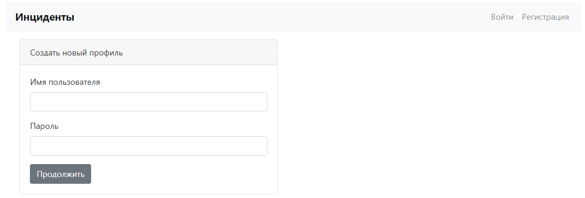

При ошибках регистрации на странице будут отражены замечания.

<a href="#contents">К оглавлению</a>

### 
2. Страница входа

На странице входа необходимо указать имя и ввести свой пароль.

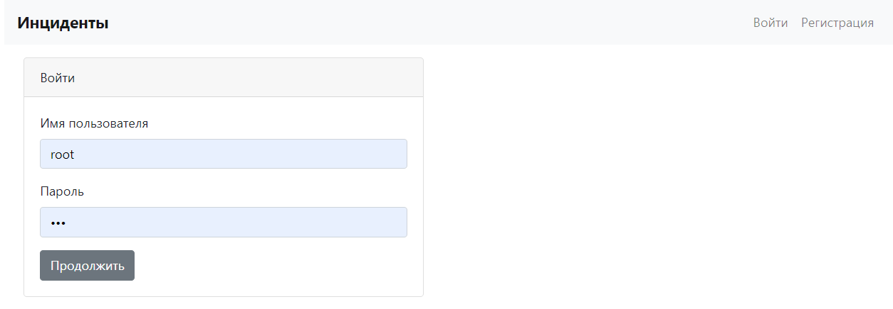

При неправильных учетных данных будет выведено
сообщение на странице входа.

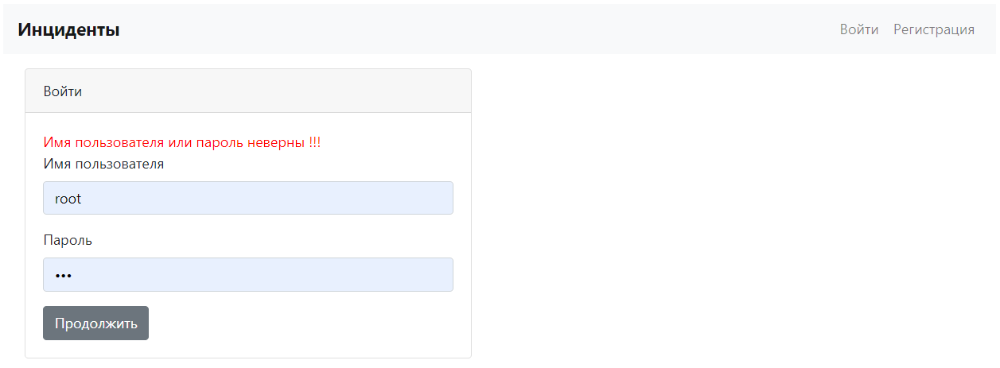

<a href="#contents">К оглавлению</a>

### 
3. Страница списка инцидентов

На странице списка инцидентов, при клике по названию инцидента
происходит переход на страницу с подробной информацией об инциденте.

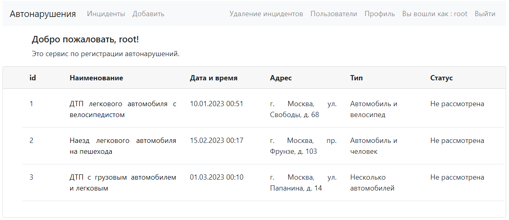

<a href="#contents">К оглавлению</a>

### 
4. Страница создания инцидента

На странице необходимо задать: наименование инцидента, адрес, подробное описание, 
тип, нарушенные правила, дата и время и фотографию,
приоритет и выбрать одну или несколько категорий.
По умолчанию статус инцидента будет `Новый`'.

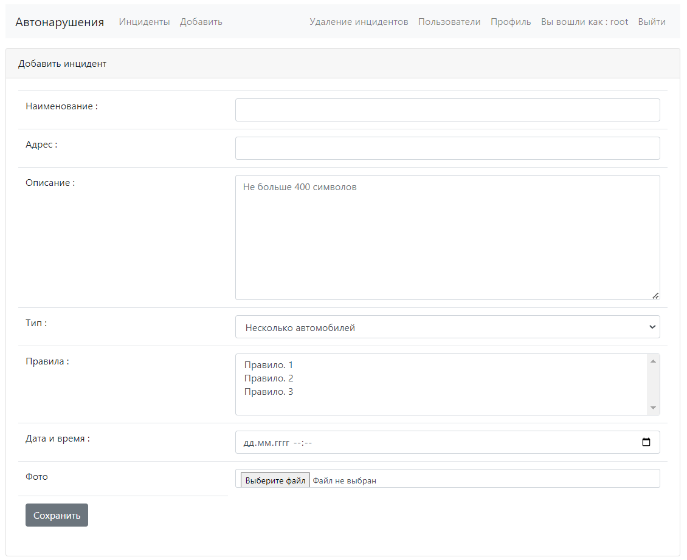

<a href="#contents">К оглавлению</a>

### 
5. Страница с подробной информацией об инциденте

На странице отображается подробное описание инцидента, есть возможность перейти к 
странице редактирования (кнопка 'Редактировать') и удалить инцидент (кнопка 'Удалить').

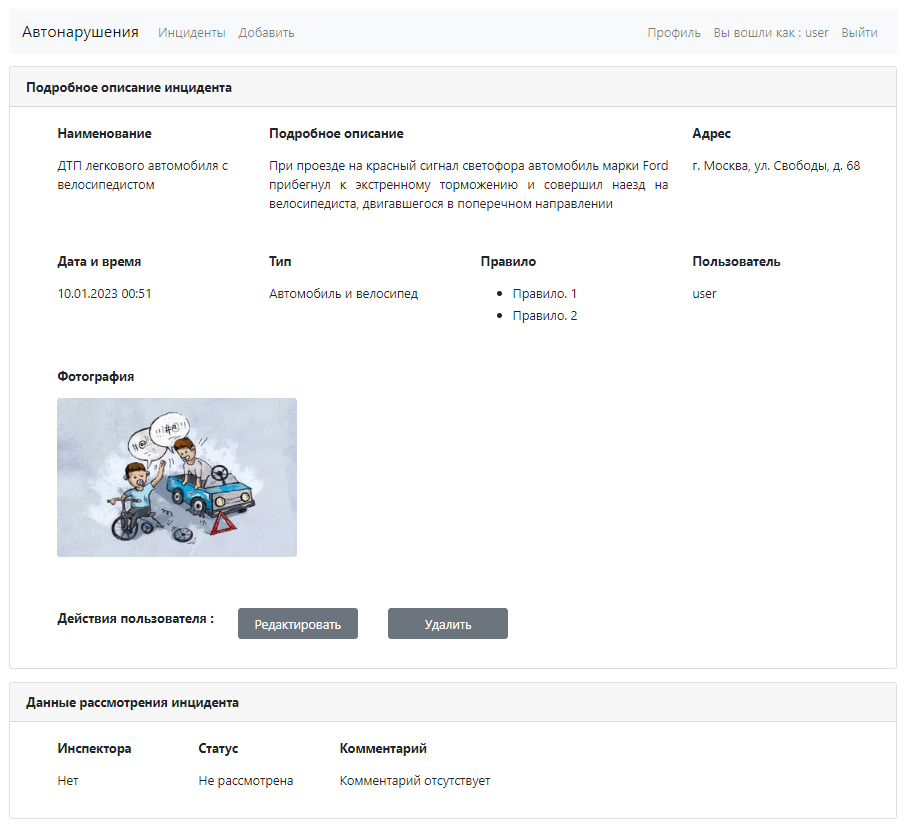

Если пользователь заходит не в свой инцидент, раздел с действиями на странице
отсутствует.

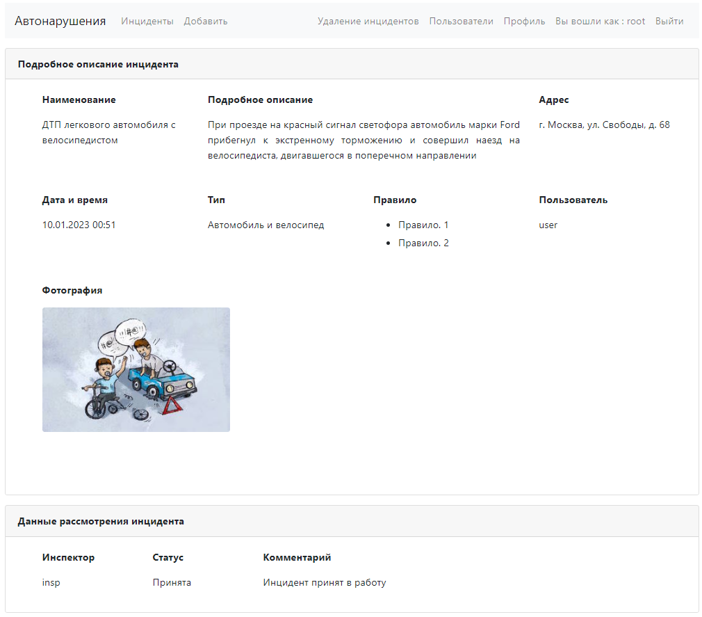

В конце страницы располагается информация о текущем статусе рассмотрения 
инцидента со стороны инспектора.

<a href="#contents">К оглавлению</a>

### 
6. Страница редактирования инцидента

Страница аналогична странице по созданию инцидента. Поля редактирования свойств
заполнены данными редактируемого инцидента.

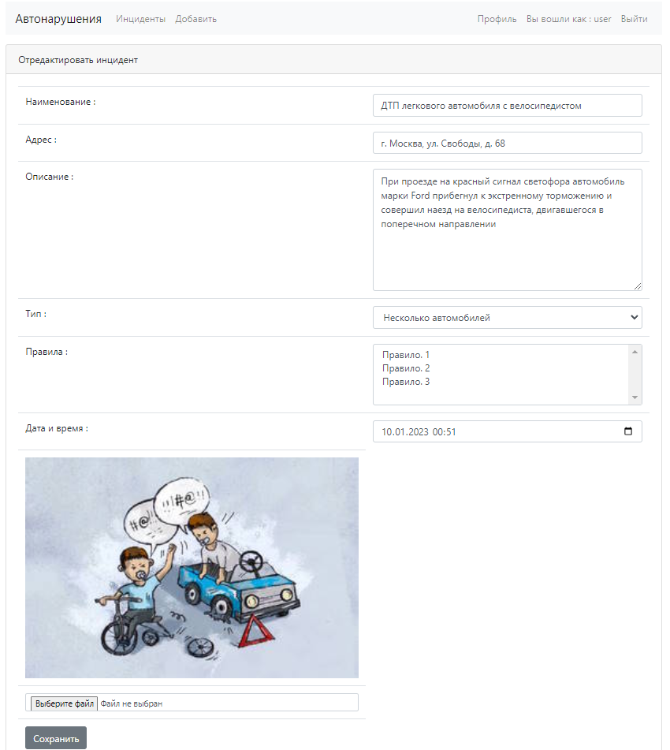

<a href="#contents">К оглавлению</a>

### 
7. Редактирование профиля

На странице редактирования профиля можно изменить: имя, пароль.

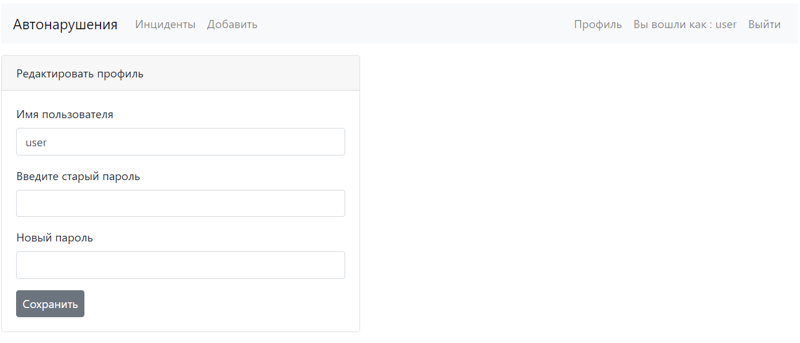

Проверка новых значений данных пользователя происходит по правилам регистрации
и аналогичным выводом ошибок заполнения в соответствующие поля.

Ошибка имени пользователя.

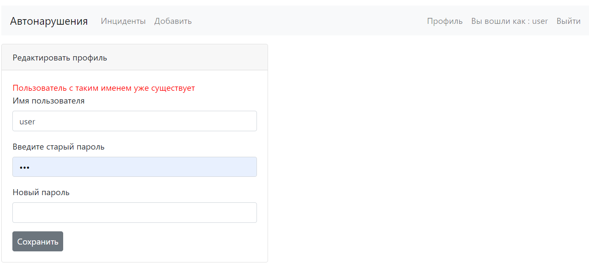

Ошибка ввода пароля.

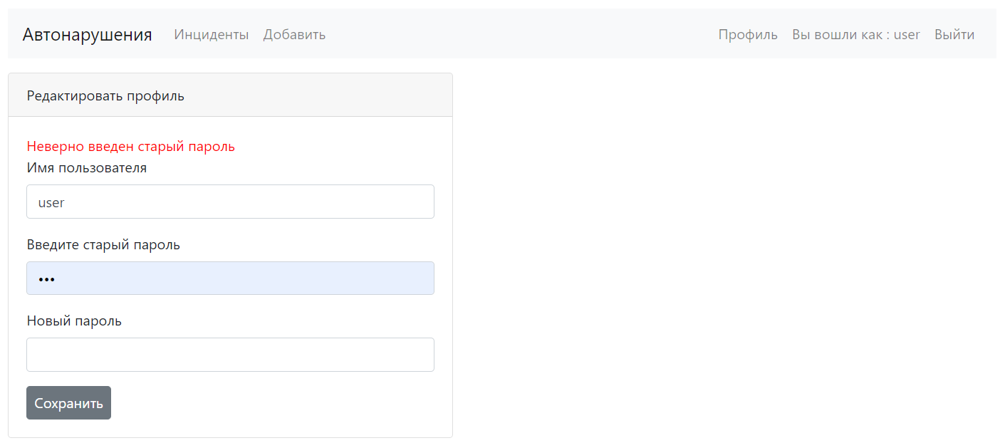

<a href="#contents">К оглавлению</a>

### 
8. Работа с правами инспектора

На странице с подробной информацией об инциденте становится доступен `Блок инспектора`
с возможностью изменению статуса инцидента (Принят, Отклонен, Закрыт, Новый) и с полем
добавления комментария, который будет виден пользователям.

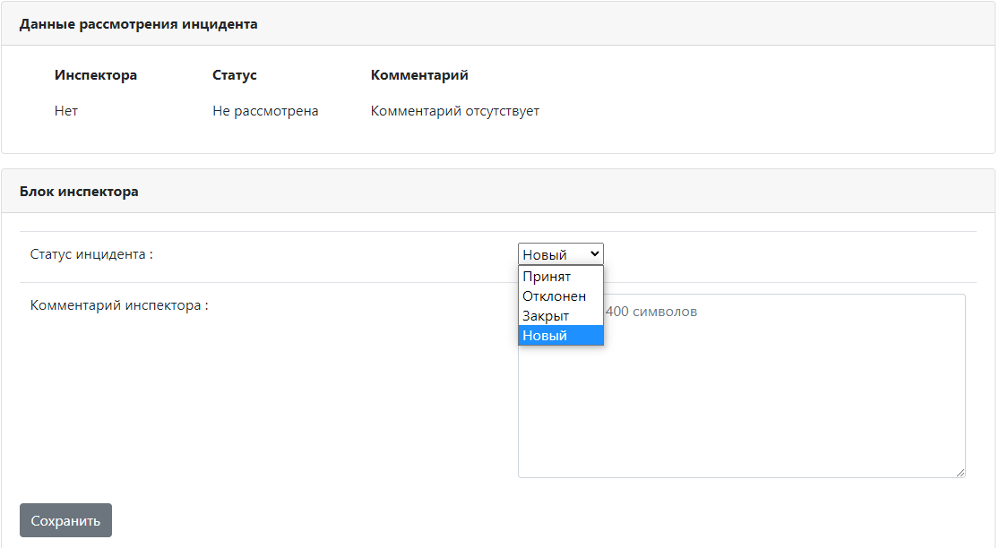

Отображение статуса инцидента, комментария инспектора и его имени выводится в блок
`Данные рассмотрения инцидента`.

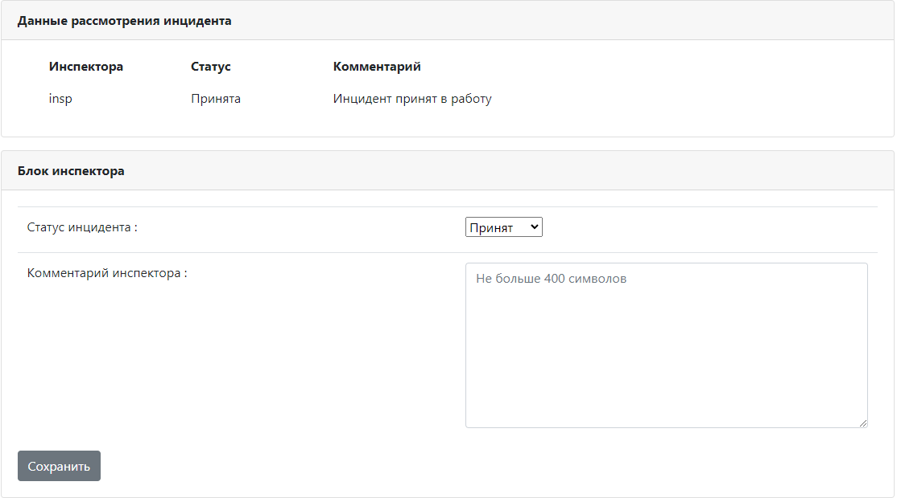

<a href="#contents">К оглавлению</a>

### 
9. Работа с правами администратора

При работе с правами администратора в основном меню становятся доступны дополнительные
формы: `Удаление инцидента`, `Пользователи`.

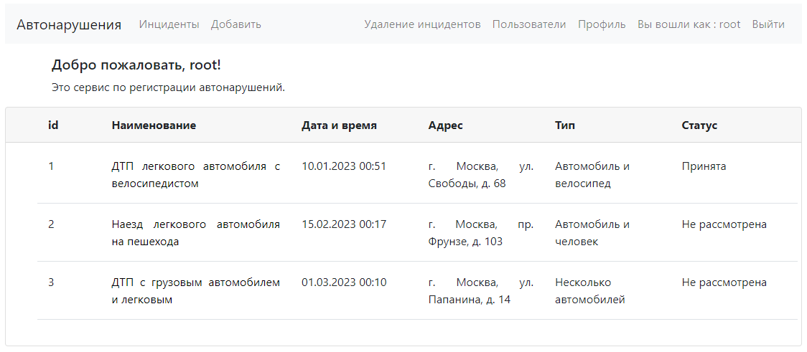

На странице`Удаление инцидента` есть возможность удалить любой инцидент.

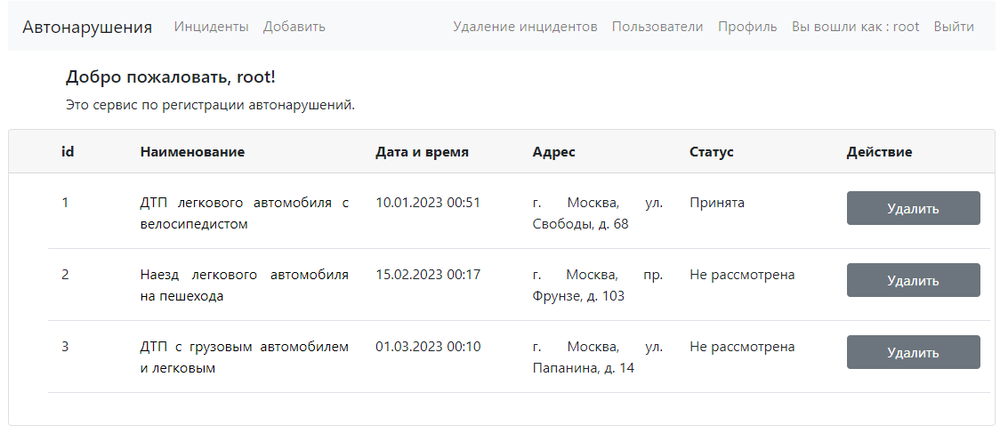

На странице `Пользователи` доступно изменение ролей и удаление пользователей.

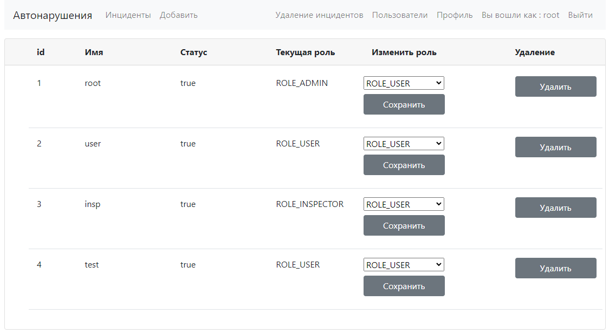

<a href="#contents">К оглавлению</a>

### 
10. Выход из приложения

При нажатии в панели навигации на ссылку "Выход", происходит
выход пользователя из приложения с перенаправлением на страницу входа и
сообщением о том, что пользователь вышел.

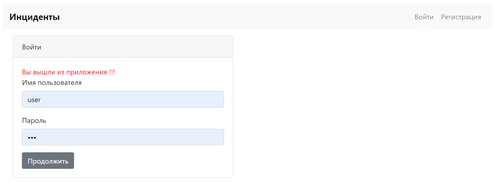

<a href="#contents">К оглавлению</a>

## 
Контакты

&nbsp;&nbsp;

&nbsp;&nbsp;

<a href="#contents">К оглавлению</a>
